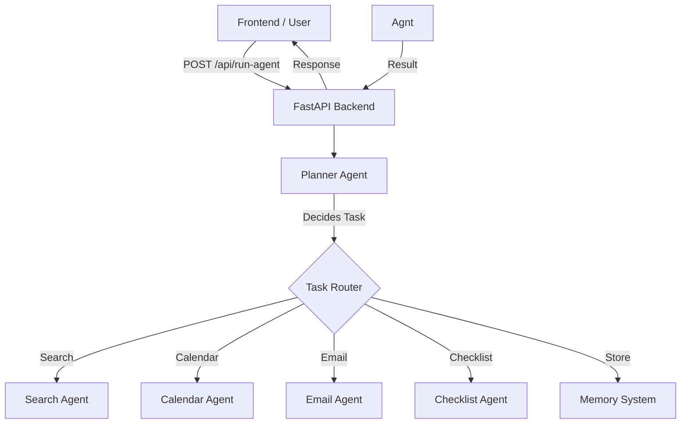

# LLM Multi-Agent Copilot System (Backend)

## 📌 Project Overview
The **LLM Multi-Agent Copilot System** is an intelligent backend service designed to act as a personal assistant that can understand natural language commands and orchestrate multiple specialized agents to perform tasks.

At its core, it uses a **Planner-Executor** architecture. A central "Planner Agent" (powered by an LLM like OpenAI or Ollama) analyzes user input, determines the necessary actions, and delegates them to specific tools (Search, Calendar, Email, Checklist). It also maintains a memory of interactions to provide context-aware responses.

## 🚀 Key Features

### 🧠 Intelligent Planning
-   **Natural Language Understanding**: Parses complex user requests using LLMs (OpenAI GPT-4o-mini or local Ollama Mistral).
-   **Dynamic Delegation**: Automatically selects the right tool for the job (e.g., "Schedule a meeting" -> Calendar Agent).
-   **Fallback Mechanism**: Includes a keyword-based fallback system if LLM services are unavailable.

### 🛠️ Specialized Agents
1.  **Planner Agent**: The brain of the system. Decides *what* to do.
2.  **Search Agent**: Simulates web searches to find information (currently mocked for demo purposes).
3.  **Calendar Agent**: Integrates with Google Calendar to create events and manage schedules.
4.  **Email Agent**: Uses SendGrid to send emails on behalf of the user.
5.  **Checklist Agent**: Manages to-do lists and tasks.

### 💾 Memory & Context
-   **Short-term Memory**: Stores recent interactions and results.
-   **Recall Capability**: Users can ask the system to "recall" previous actions or information (e.g., "What did I search for yesterday?").

## 🏗️ Architecture

The system is built using **FastAPI** for high-performance, asynchronous API handling.



## ⚙️ Setup & Installation

### Prerequisites
-   Python 3.8+
-   [OpenAI API Key](https://platform.openai.com/) (Optional, for GPT models)
-   [SendGrid API Key](https://sendgrid.com/) (Optional, for Email)
-   [Google Cloud Credentials](https://console.cloud.google.com/) (Optional, for Calendar)

### Installation

1.  **Clone the repository**:
    ```bash
    git clone https://github.com/your-repo/LLM-Multi-Agent-Copilot-System.git
    cd LLM-Multi-Agent-Copilot-System/backend
    ```

2.  **Create a virtual environment**:
    ```bash
    python -m venv venv
    source venv/bin/activate  # On Windows: venv\Scripts\activate
    ```

3.  **Install dependencies**:
    ```bash
    pip install -r requirements.txt
    ```

4.  **Environment Configuration**:
    Create a `.env` file in the `backend` directory:
    ```env
    OPENAI_API_KEY=your_openai_key
    SENDGRID_API_KEY=your_sendgrid_key
    # Google Credentials path if using file-based auth
    GOOGLE_APPLICATION_CREDENTIALS=path/to/credentials.json
    ```

### Running the Server

Start the backend server using Uvicorn:

```bash
uvicorn main:app --reload
```

The API will be available at `http://localhost:8000`.
You can access the interactive API docs at `http://localhost:8000/docs`.

## 🔌 API Endpoints

### `POST /api/run-agent`
Main entry point for user commands.
**Request Body:**
```json
{
  "input": "Plan a trip to Seattle and email me the itinerary"
}
```

### `GET /api/recall-memory`
Retrieve past interactions.
**Query Parameters:**
-   `keyword`: Filter by a specific keyword.
-   `all`: Set to `true` to retrieve all history.

## 🔮 Future Scope & Extensions

To make this system production-ready and more powerful, the following extensions are planned:

1.  **Real Web Search**: Replace the mock Search Agent with a real implementation using APIs like Google Custom Search or Tavily.
2.  **Persistent Database**: Migrate from in-memory `memory_store` to a persistent database (PostgreSQL or MongoDB) to save user history across restarts.
3.  **Authentication**: Add user authentication (OAuth2/JWT) to support multiple users securely.
4.  **Advanced Calendar**: Support for reading events, updating existing events, and handling conflicts.
5.  **More Integrations**:
    -   **Slack/Discord**: For messaging.
    -   **Notion/Jira**: For project management.
    -   **File System**: Ability to read/write local files.
6.  **Frontend Enhancements**: A more interactive chat interface with rich media support (rendering markdown, images, etc.).
7.  **Voice Interface**: Add Speech-to-Text (STT) and Text-to-Speech (TTS) for a full voice assistant experience.
